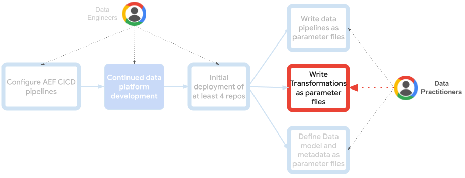
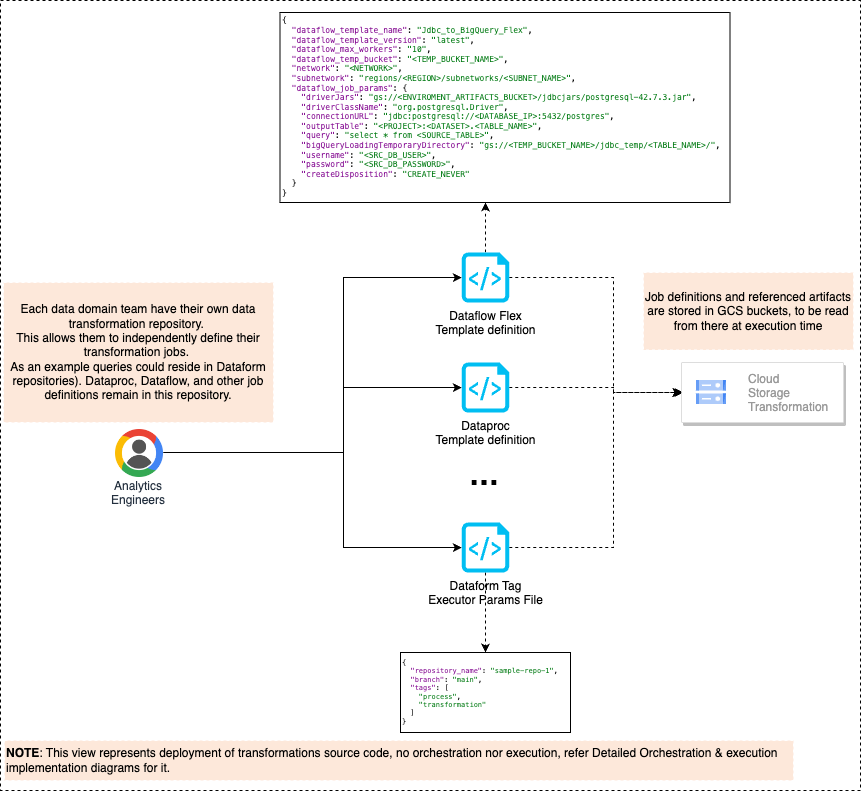

# Analytics Engineering Framework - Data Transformation
***Note:*** For a comprehensive installation guide of all the AEF repositories together, please look [here](https://github.com/oscarpulido55/aef-orchestration-framework/blob/main/AEF_DEPLOYMENT.md).

[Analytics engineers](https://www.getdbt.com/what-is-analytics-engineering) lay the foundation for others to organize, transform, and document data using software engineering principles. Providing easy to use data platforms that empower data practitioners to independently build data pipelines in a standardized and scalable way, and answer their own data-driven questions.

This opinionated data transformation management repository can be used independently to define, store, and deploy data transformation definitions. However, is designed as a component within a comprehensive Analytics Engineering Framework comprising:
1. [Orchestration Framework](https://github.com/oscarpulido55/aef-orchestration-framework): Maintained by Analytics Engineers to provide seamless, extensible orchestration and execution infrastructure.
1. [Data Model](https://github.com/oscarpulido55/aef-data-model): Directly used by end data practitioners to manage data models, schemas, and Dataplex metadata.
1. [Data Orchestration](https://github.com/oscarpulido55/aef-data-orchestration): Directly used by end data practitioners to define and deploy data pipelines using levels, threads, and steps.
1. **(This repository) Data Transformation**: Directly used by end data practitioners to define, store, and deploy data transformations.


### Repository
This repository is a central location for storing and deploy artifacts necessary for your data transformations, such as JDBC drivers and compiled JAR dependencies. However, its core function is to maintain configuration files that define your transformations. These JSON, YAML, or similar parameter files are referenced as reusable steps in your data pipelines, and are interpreted by the execution infrastructure within the Orchestration framework.


```
├── artifacts
│   ├── dataporc
│   │   └── custom_dependency.jar
│   ├── jdbcjars
│   │   └── postgresql.jar
│   └── ...
└── config
    ├── dev
    │   └── jobs
    │   │    ├── dataflow-flextemplate-job-executor
    │   │    │   └── sample_jdbc_dataflow_ingestion.json
    │   │    │   └── ...        
    │   │    ├── dataform-tag-executor
    │   │    │   └── run_dataform_tag.json
    │   │    │   └── ... 
    │   │    ├── dataproc-serverless-job-executor
    │   │    └── ...
    │   └── dev.tfvars
    ├── prod
    └── ...
```

### Terraform:
1. Define your terraform variables in `config/[ENVIRONMENT]/[ENVIRONMENT].tfvars`. See [here](./terraform/README.md) for details.

1. Run the Terraform Init / Plan / Apply as required using the variables you defined.
    ```bash
    cd terraform
    terraform init
    terraform plan --var-file ../config/[ENVIRONMENT]/[ENVIRONMENT].tfvars -out [ENVIRONMENT].plan
    terraform apply [ENVIRONMENT].plan
    ```

### CICD

Currently only GitHub Actions has been configured in the repository to render the templates and deploy the infrastructure.

In order to enable this, Workload Identity Federation needs to be established. See the following blog for the required setup steps: https://cloud.google.com/blog/products/identity-security/enabling-keyless-authentication-from-github-actions.

## Usage
While this repository can be used to keep track of your dependencies and data transformation definitions, the provided terraform code can be used to control deployment, but you can deploy it as another step in your CI/CD pipeline instead.
1. Place and commit your artifacts.
2. Place and commit your job definition parameter files.
3. Define your terraform variables and deploy (plan/apply).
